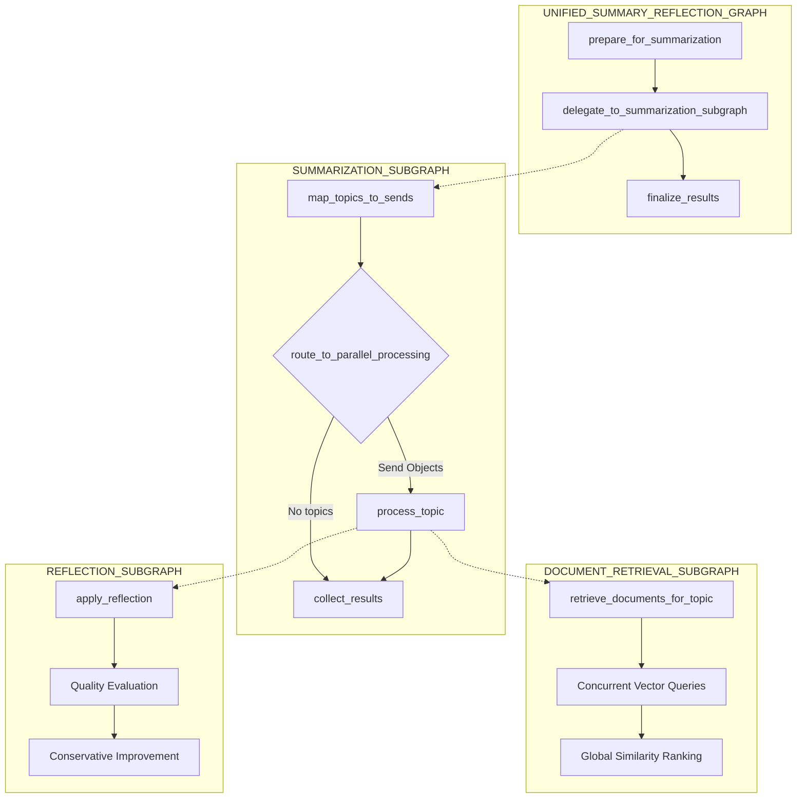
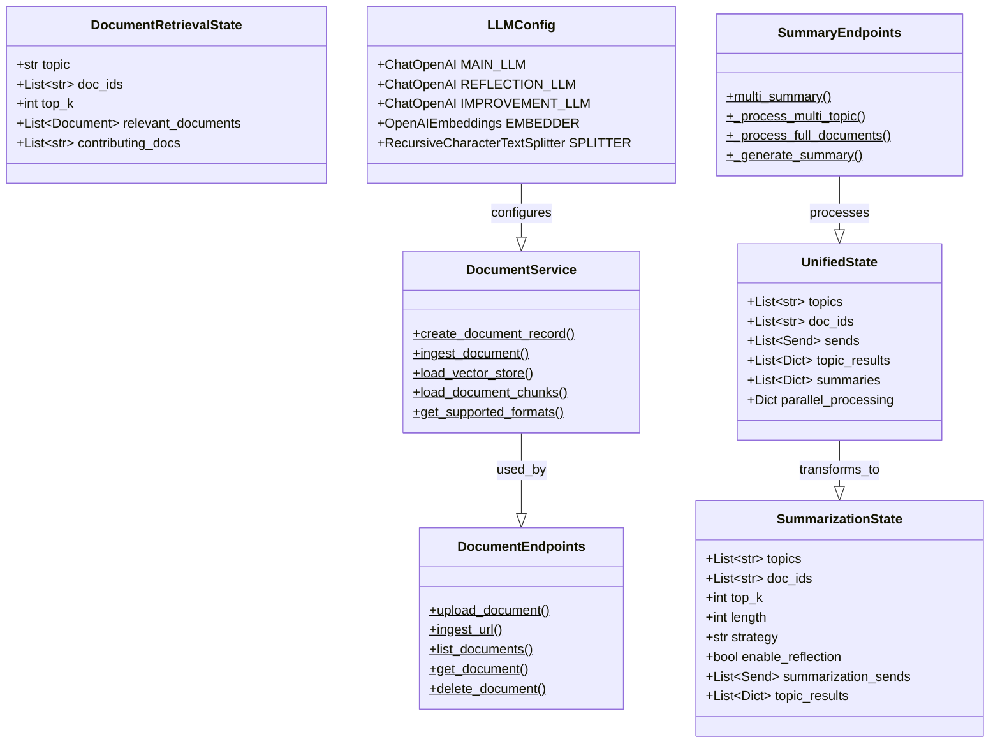
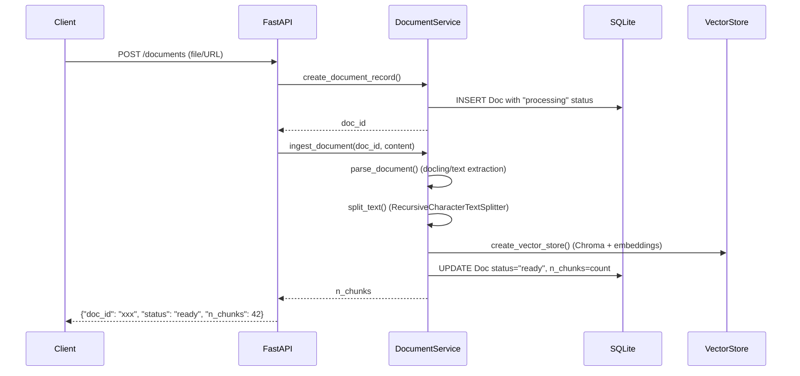
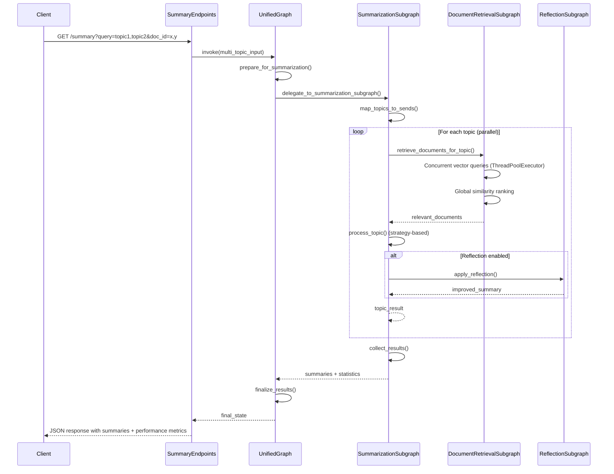

# LangGraph Document Processing Service - Architecture Documentation

## Table of Contents
1. [Overview](#overview)
2. [Core Architectural Patterns](#core-architectural-patterns)
3. [System Architecture Diagrams](#system-architecture-diagrams)
4. [LangGraph Implementation](#langgraph-implementation)
5. [Service Layer Architecture](#service-layer-architecture)
6. [Data Flow and Processing Pipelines](#data-flow-and-processing-pipelines)
7. [Configuration Management](#configuration-management)
8. [Concurrent Processing Patterns](#concurrent-processing-patterns)
9. [API Design and Integration](#api-design-and-integration)
10. [Database and Storage Architecture](#database-and-storage-architecture)

## Overview

This is a **modular document processing service** built around **LangGraph workflows** with a focus on **parallel processing**, **reusable subgraphs**, and **proper state management**. The architecture follows current LangGraph best practices for building resilient, scalable AI workflows.

### Key Features
- **Multi-modal document processing** (20+ formats including PDFs, images, web content)
- **LangGraph Send API** for true parallel processing of topics
- **Modular subgraph architecture** for reusable workflow components
- **Cross-document similarity ranking** with concurrent vector queries
- **Strategy-based summarization** (extractive, abstractive, hybrid)
- **AI-powered reflection system** for quality improvement
- **FastAPI endpoints** with optional JWT authentication

## Core Architectural Patterns

### 1. **Modular Microservice Architecture**
```
┌─────────────────────────────────────────────────────────────┐
│                    API Layer (FastAPI)                     │
├─────────────────────────────────────────────────────────────┤
│                  Service Layer                              │
│  ┌─────────────────┐ ┌─────────────────┐ ┌──────────────┐  │
│  │ DocumentService │ │WebContentService│ │ Topic Utils  │  │
│  │                 │ │                 │ │              │  │
│  │ • File parsing  │ │ • URL fetching  │ │ • Processing │  │
│  │ • Vector stores │ │ • Content clean │ │ • Reflection │  │
│  │ • CRUD ops      │ │ • Metadata      │ │ • Strategies │  │
│  └─────────────────┘ └─────────────────┘ └──────────────┘  │
├─────────────────────────────────────────────────────────────┤
│                  LangGraph Workflows                        │
│  ┌─────────────────────────────────────────────────────────┐ │
│  │           UNIFIED_SUMMARY_REFLECTION_GRAPH              │ │
│  │                                                         │ │
│  │  ┌─────────────────┐ ┌─────────────────┐ ┌──────────┐  │ │
│  │  │  DOCUMENT_      │ │ SUMMARIZATION_  │ │REFLECTION│  │ │
│  │  │  RETRIEVAL_     │ │    SUBGRAPH     │ │ SUBGRAPH │  │ │
│  │  │  SUBGRAPH       │ │                 │ │          │  │ │
│  │  └─────────────────┘ └─────────────────┘ └──────────┘  │ │
│  └─────────────────────────────────────────────────────────┘ │
├─────────────────────────────────────────────────────────────┤
│                 Data Layer                                  │
│  ┌─────────────────┐           ┌─────────────────────────┐  │
│  │ SQLite Database │           │  Vector Stores (Chroma) │  │
│  │                 │           │                         │  │
│  │ • Document meta │    ◄────► │ • Per-document stores   │  │
│  │ • Status track  │           │ • Embeddings + chunks   │  │
│  │ • User data     │           │ • Similarity search     │  │
│  └─────────────────┘           └─────────────────────────┘  │
└─────────────────────────────────────────────────────────────┘
```

### 2. **Design Patterns Used**
- **Strategy Pattern**: Pluggable summarization algorithms
- **Repository Pattern**: Data access abstraction
- **Service Layer Pattern**: Business logic separation
- **State Machine Pattern**: LangGraph workflow management
- **Observer Pattern**: Progress tracking and statistics
- **Dependency Injection**: Configuration management

## System Architecture Diagrams

### LangGraph Workflow Architecture



### Class Relationship Diagram



## LangGraph Implementation

### 1. **Send API Parallel Processing**

The core innovation is using LangGraph's Send API for true parallel processing:

```python
# Dynamic Send object creation for parallel topic processing
def map_topics_to_sends(state: SummarizationState) -> SummarizationState:
    sends = []
    for i, topic in enumerate(topics):
        # Retrieve documents and prepare content
        topic_relevant_docs, doc_sources = retrieve_documents_for_topic(topic, doc_ids, top_k)
        source_content = prepare_source_content(topic_relevant_docs)
        
        # Create task state for Send API
        task_state = SummarizationTaskState(
            topic_id=i,
            topic=topic.strip(),
            docs=topic_relevant_docs,
            source_content=source_content,
            length=length,
            strategy=strategy,
            enable_reflection=enable_reflection
        )
        
        sends.append(Send("process_topic", task_state))
    
    return {"summarization_sends": sends}

# Conditional routing to parallel execution
graph.add_conditional_edges(
    "map_topics_to_sends",
    route_to_parallel_processing,  # Returns Send objects
    ["process_topic", "collect_results"]  # Target nodes
)
```

### 2. **State Management with TypedDict & Reducers**

Proper state schemas with annotated reducers for automatic aggregation:

```python
from typing import TypedDict, Annotated, List, Dict, Any
import operator

class UnifiedState(TypedDict):
    topics: List[str]
    doc_ids: List[str]
    # Automatic result aggregation using annotated reducers
    topic_results: Annotated[List[Dict[str, Any]], operator.add]
    summaries: List[Dict[str, Any]]
    parallel_processing: Dict[str, Any]
```

### 3. **Modular Subgraph Architecture**

The system uses three main subgraphs:

```python
# Document retrieval with concurrent vector queries
DOCUMENT_RETRIEVAL_SUBGRAPH = build_document_retrieval_subgraph()

# Topic summarization with Send API parallel processing  
SUMMARIZATION_SUBGRAPH = build_summarization_subgraph()

# Quality reflection and improvement
REFLECTION_SUBGRAPH = build_reflection_subgraph()

# Main orchestrator graph using subgraph composition
UNIFIED_SUMMARY_REFLECTION_GRAPH = build_unified_summary_reflection_graph()
```

### 4. **State Transformation Utilities**

Clean integration between different state schemas:

```python
def unified_to_summarization_state(unified_state: UnifiedState) -> SummarizationState:
    """Transform UnifiedState to SummarizationState for subgraph delegation."""
    return SummarizationState(
        topics=unified_state["topics"],
        doc_ids=unified_state["doc_ids"],
        top_k=unified_state.get("top_k", 10),
        length=unified_state.get("length", 8),
        strategy=unified_state.get("strategy", "abstractive"),
        enable_reflection=unified_state.get("enable_reflection", False)
    )

def summarization_to_unified_state(
    summarization_result: SummarizationState, 
    original_state: UnifiedState
) -> UnifiedState:
    """Transform SummarizationState results back to UnifiedState."""
    return {
        **original_state,
        "summaries": summarization_result.get("summaries", []),
        "parallel_processing": summarization_result.get("parallel_processing", {})
    }
```

## Service Layer Architecture

### DocumentService (Static Methods)

```python
class DocumentService:
    """Centralized document processing service with comprehensive format support."""
    
    SUPPORTED_FORMATS = {
        "documents": [".txt", ".md", ".pdf", ".docx", ".html", ".csv", ".xml"],
        "images": [".png", ".jpg", ".jpeg", ".tiff", ".bmp", ".webp"],  # OCR support
        "web": ["http://", "https://"]  # URL content fetching
    }
    
    @staticmethod
    async def create_document_record(name: str) -> str:
        """Create database record and return document ID."""
        
    @staticmethod  
    def ingest_document(doc_id: str, file_path: str, filename: str) -> int:
        """Complete ingestion pipeline: parse → split → embed → persist."""
        
    @staticmethod
    def load_vector_store(doc_id: str) -> Chroma:
        """Load per-document vector store with lazy initialization."""
        
    @staticmethod
    def load_document_chunks(doc_id: str) -> List[Document]:
        """Load document chunks from JSON storage."""
```

### WebContentService

```python
class WebContentService:
    """Web content fetching and processing."""
    
    @staticmethod
    def fetch_content(url: str) -> str:
        """Fetch and clean web content using LangChain WebBaseLoader."""
        
    @staticmethod  
    def is_valid_url(url: str) -> bool:
        """Validate URL format and accessibility."""
```

### Topic Processing Utilities

```python
def query_single_document(doc_id: str, query: str, candidates_per_doc: int) -> Tuple[List, str, int]:
    """Unified helper function for concurrent document querying."""
    
def retrieve_documents_for_topic(topic: str, doc_ids: List[str], top_k: int) -> Tuple[List[Document], List[str]]:
    """Concurrent cross-document similarity ranking."""
    
def process_single_topic_complete(topic_id: int, topic: str, docs: List[Document], 
                                source_content: str, length: int, strategy: str, 
                                enable_reflection: bool) -> Dict[str, Any]:
    """Complete topic processing pipeline with summarization and optional reflection."""
```

## Data Flow and Processing Pipelines

### 1. **Document Ingestion Pipeline**



### 2. **Multi-Topic Summarization Pipeline**



### 3. **Cross-Document Similarity Search**

```mermaid
flowchart TD
    A[Query: "machine learning"] --> B[ThreadPoolExecutor<br/>MAX_DB_QUERY_WORKERS=8]
    
    B --> C1[Doc1: query_single_document<br/>score1, score2, score3]
    B --> C2[Doc2: query_single_document<br/>score4, score5, score6]  
    B --> C3[Doc3: query_single_document<br/>score7, score8, score9]
    B --> C4[DocN: query_single_document<br/>scoreX, scoreY, scoreZ]
    
    C1 --> D[Global Candidate Collection<br/>all_candidates = [...]]
    C2 --> D
    C3 --> D
    C4 --> D
    
    D --> E[Global Ranking<br/>all_candidates.sort(key=lambda x: x[1])]
    E --> F[Top-K Selection<br/>top_candidates = all_candidates[:top_k]]
    F --> G[Result Assembly<br/>documents + contributing_docs + statistics]
```

## Configuration Management

### 1. **Centralized LLM Configuration**

```python
class LLMConfig:
    """Role-specific LLM instances for different tasks."""
    
    # General purpose - balanced temperature
    MAIN_LLM = ChatOpenAI(
        model="gpt-4o-mini",
        temperature=0.2,
        max_tokens=2000
    )
    
    # Reflection tasks - consistency focused
    REFLECTION_LLM = ChatOpenAI(
        model="gpt-4o-mini", 
        temperature=0.1,  # Lower temperature for consistency
        max_tokens=1500
    )
    
    # Improvement tasks - creativity focused
    IMPROVEMENT_LLM = ChatOpenAI(
        model="gpt-4o-mini",
        temperature=0.3,  # Higher temperature for creativity
        max_tokens=2000
    )
    
    # Embeddings for similarity search
    EMBEDDER = OpenAIEmbeddings(model="text-embedding-ada-002")
    
    # Text splitting configuration
    SPLITTER = RecursiveCharacterTextSplitter(
        chunk_size=800,
        chunk_overlap=100,
        separators=["\n\n", "\n", " ", ""]
    )
```

### 2. **Parallel Processing Configuration**

```python
class ParallelConfig:
    """Centralized parallel processing limits and timeouts."""
    
    # LangGraph Send API parallelism
    MAX_TOPIC_WORKERS = 5
    
    # ThreadPoolExecutor for database queries
    MAX_DB_QUERY_WORKERS = 8
    
    # Processing timeouts and limits
    PROCESSING_TIMEOUT = 300  # seconds
    MAX_CHUNKS_PER_TOPIC = 20
    MAX_SOURCE_CONTENT_LENGTH = 4000
    
    # Reflection settings
    REFLECTION_ENABLED_BY_DEFAULT = False
    MAX_REFLECTION_RETRIES = 2
```

### 3. **Environment Variables**

```bash
# Required
OPENAI_API_KEY=sk-...

# Optional (Authentication)
API_AUTH_KEY=your-secret-key  # Leave empty to disable auth
JWT_SECRET_KEY=jwt-signing-key  # Required if auth enabled

# Optional (Database)
DATABASE_URL=sqlite:///./documents.db

# Optional (Vector Storage)
VECTOR_DB_PATH=./vector_db
```

## Concurrent Processing Patterns

### 1. **LangGraph Send API (Topic-Level Parallelism)**

```python
# Native LangGraph parallelism for topic processing
MAX_TOPIC_WORKERS = 5

def map_topics_to_sends(state: SummarizationState) -> SummarizationState:
    sends = []
    for i, topic in enumerate(topics):
        # Each topic becomes a Send object for parallel processing
        task_state = SummarizationTaskState(...)
        sends.append(Send("process_topic", task_state))
    
    return {"summarization_sends": sends}

# Conditional routing enables automatic parallelization
graph.add_conditional_edges(
    "map_topics_to_sends",
    route_to_parallel_processing,  # Returns Send objects
    ["process_topic", "collect_results"]
)
```

**Benefits:**
- **Superstep-based execution**: If any Send fails, entire superstep errors but successful results are checkpointed
- **Automatic state aggregation**: Results automatically merged using annotated reducers
- **Error isolation**: Individual topic failures don't affect other topics
- **Native LangGraph integration**: No external thread management needed

### 2. **ThreadPoolExecutor (Database Query Parallelism)**

```python
# Concurrent vector store queries across documents
MAX_DB_QUERY_WORKERS = 8

def retrieve_documents_for_topic(topic: str, doc_ids: List[str], top_k: int):
    all_candidates = []
    
    with ThreadPoolExecutor(max_workers=min(len(doc_ids), MAX_DB_QUERY_WORKERS)) as executor:
        # Submit all document queries concurrently
        future_to_doc_id = {
            executor.submit(query_single_document, doc_id, topic, candidates_per_doc): doc_id 
            for doc_id in doc_ids
        }
        
        # Collect results as they complete
        for future in as_completed(future_to_doc_id):
            doc_id = future_to_doc_id[future]
            try:
                candidates, returned_doc_id, count = future.result()
                all_candidates.extend(candidates)
            except Exception as e:
                print(f"Error processing doc {doc_id}: {e}")
                continue
    
    # Global ranking across all documents
    all_candidates.sort(key=lambda x: x[1])  # Sort by similarity score
    return all_candidates[:top_k]
```

**Benefits:**
- **I/O parallelism**: Multiple vector store queries execute simultaneously
- **Resource limits**: Bounded by MAX_DB_QUERY_WORKERS to prevent overload
- **Error resilience**: Individual document failures don't stop other queries
- **Performance monitoring**: Statistics collected per document

### 3. **Performance Monitoring and Metrics**

```python
# Comprehensive performance tracking
parallel_processing_stats = {
    "total_time": 12.34,  # Wall clock time for entire operation
    "method": "LangGraph_Send_API",  # Processing method used
    "topics_count": 3,
    "average_time_per_topic": 4.11,
    "speedup_factor": 2.8,  # Sequential time / parallel time  
    "efficiency": 93.3,  # (speedup / workers) * 100
    "max_workers": 5,
    "reflection_statistics": {
        "total_topics": 3,
        "reflection_applied": 2,
        "reflection_skipped": 1
    }
}
```

## API Design and Integration

### 1. **RESTful Endpoint Organization**

```python
# Document management endpoints
class DocumentEndpoints:
    POST   /documents          # Upload file
    POST   /documents/url      # Ingest URL
    GET    /documents          # List all documents
    GET    /documents/{id}     # Get document details
    DELETE /documents/{id}     # Delete document
    GET    /documents/{id}/chunks  # Get document chunks

# Summarization endpoints  
class SummaryEndpoints:
    GET    /summary            # Multi-modal summarization
    # Query parameters:
    # - doc_id: List[str] (optional, defaults to all ready docs)
    # - query: str (optional, enables topic-focused processing)
    # - length: int (1-30 sentences)
    # - strategy: str (extractive|abstractive|hybrid)
    # - top_k: int (chunks per topic)
    # - enable_reflection: bool

# Question answering endpoints
class QAEndpoints:
    GET    /ask                # Question answering
    # Query parameters:
    # - q: str (required question)
    # - doc_id: List[str] (optional, defaults to all ready docs)
    # - top_k: int (number of context chunks)
```

### 2. **Authentication Flow**

```python
# Conditional JWT authentication
@app.middleware("http")
async def auth_middleware(request: Request, call_next):
    if config.API_AUTH_KEY:  # Auth enabled
        if request.url.path.startswith("/auth"):
            return await call_next(request)  # Auth endpoints bypass
        
        # Require JWT token
        token = request.headers.get("Authorization", "").replace("Bearer ", "")
        if not verify_jwt_token(token):
            return JSONResponse({"error": "Invalid token"}, status_code=401)
    
    return await call_next(request)

# Login endpoint
POST /auth/login
{
    "api_key": "your-api-key"
}
→ 
{
    "access_token": "eyJ...",
    "token_type": "bearer"
}
```

### 3. **Request/Response Patterns**

```python
# Multi-topic summarization request
GET /summary?query=AI,machine%20learning&doc_id=doc1,doc2&length=5&strategy=hybrid&enable_reflection=true

# Response with comprehensive metadata
{
    "type": "multi_topic",
    "documents": ["doc1", "doc2"],
    "topics": ["AI", "machine learning"],
    "strategy": "hybrid",  
    "successful_topics": 2,
    "total_topics": 2,
    "summaries": [
        {
            "topic": "AI",
            "topic_id": 0,
            "summary": "Artificial intelligence represents...",
            "chunks_processed": 15,
            "status": "success",
            "processing_time": 3.45,
            "strategy": "hybrid",
            "reflection_applied": true,
            "changes_made": ["Improved clarity", "Added context"]
        }
    ],
    "parallel_processing": {
        "total_time": 4.12,
        "method": "LangGraph_Send_API",
        "speedup_factor": 2.1,
        "efficiency": 84.2
    },
    "reflection_statistics": {
        "total_topics": 2,
        "reflection_applied": 2,
        "reflection_skipped": 0
    }
}
```

## Database and Storage Architecture

### 1. **Dual Storage System**

```
┌─────────────────────────────────────────────────────────────┐
│                    Storage Architecture                     │
│                                                             │
│  ┌─────────────────────┐    ┌─────────────────────────────┐ │
│  │   SQLite Database   │    │    Vector Stores (Chroma)   │ │
│  │                     │    │                             │ │
│  │ ┌─────────────────┐ │    │  ┌─────────────────────────┐ │ │
│  │ │   Doc Model     │ │    │  │   Per-Document Stores   │ │ │
│  │ │                 │ │    │  │                         │ │ │
│  │ │ • id (UUID)     │ │◄──►│  │ • doc_id/               │ │ │
│  │ │ • name          │ │    │  │   ├── chroma.sqlite3    │ │ │
│  │ │ • status        │ │    │  │   ├── chunks.json       │ │ │
│  │ │ • n_chunks      │ │    │  │   └── collection_id/    │ │ │
│  │ │ • created_at    │ │    │  │       └── HNSW data     │ │ │
│  │ └─────────────────┘ │    │  └─────────────────────────┘ │ │
│  └─────────────────────┘    └─────────────────────────────┘ │
│                                                             │
│  Metadata & Status           Embeddings & Similarity       │
│  ACID Transactions           Vector Search Operations       │
└─────────────────────────────────────────────────────────────┘
```

### 2. **Document Model Schema**

```python
class Doc(SQLModel, table=True):
    """Document metadata model with status tracking."""
    
    id: str = Field(primary_key=True)  # UUID
    name: str = Field(max_length=255)
    status: str = Field(default="processing")  # processing|ready|failed
    n_chunks: Optional[int] = Field(default=None)
    created_at: datetime = Field(default_factory=datetime.utcnow)
    
    # Status lifecycle: processing → ready|failed
    # Only "ready" documents are available for summarization/QA
```

### 3. **Vector Store Organization**

```bash
vector_db/
├── doc_uuid_1/
│   ├── chroma.sqlite3      # Chroma SQLite index
│   ├── chunks.json         # Document chunks for reconstruction
│   └── collection_uuid/    # HNSW vector data
│       ├── data_level0.bin
│       ├── header.bin
│       └── link_lists.bin
├── doc_uuid_2/
│   ├── chroma.sqlite3
│   ├── chunks.json
│   └── collection_uuid/
└── ...
```

### 4. **Storage Operations**

```python
class DocumentService:
    @staticmethod
    def create_vector_store(doc_id: str, chunks: List[Document]) -> int:
        """Create per-document vector store with embeddings."""
        vs_dir = BASE_DIR / doc_id
        vs_dir.mkdir(exist_ok=True)
        
        # Create Chroma vector store
        vectorstore = Chroma(
            collection_name=doc_id,
            embedding_function=LLMConfig.EMBEDDER,
            persist_directory=str(vs_dir)
        )
        
        # Add documents with embeddings
        vectorstore.add_documents(chunks)
        
        # Persist chunks for reconstruction
        chunks_data = [{"content": chunk.page_content, "metadata": chunk.metadata} 
                      for chunk in chunks]
        
        with open(vs_dir / "chunks.json", "w") as f:
            json.dump(chunks_data, f, indent=2)
        
        return len(chunks)
    
    @staticmethod  
    def load_vector_store(doc_id: str) -> Chroma:
        """Load existing vector store with lazy initialization."""
        vs_dir = BASE_DIR / doc_id
        if not vs_dir.exists():
            raise FileNotFoundError(f"Vector store not found: {doc_id}")
            
        return Chroma(
            collection_name=doc_id,
            embedding_function=LLMConfig.EMBEDDER,
            persist_directory=str(vs_dir)
        )
```

## Performance Characteristics

### 1. **Parallel Processing Performance**

```python
# Example performance metrics from real execution
{
    "parallel_processing": {
        "total_time": 8.45,              # Wall clock time (seconds)
        "estimated_sequential_time": 23.12,  # Sum of individual times
        "speedup_factor": 2.74,          # 23.12 / 8.45 = 2.74x faster
        "efficiency": 54.8,              # (2.74 / 5 workers) * 100 = 54.8%
        "longest_individual_task": 7.89, # Bottleneck task time
        "method": "LangGraph_Send_API",
        "max_workers": 5
    }
}
```

### 2. **Scaling Characteristics**

- **Topics**: Linear scaling up to MAX_TOPIC_WORKERS (5)
- **Documents**: Linear scaling up to MAX_DB_QUERY_WORKERS (8)  
- **Memory**: ~50MB per document + ~200MB base (LLM models)
- **Disk**: ~10MB per 1000 document chunks (embeddings + text)

### 3. **Resource Limits**

```python
# Configuration limits prevent resource exhaustion
ParallelConfig.MAX_TOPIC_WORKERS = 5           # LangGraph Send API
ParallelConfig.MAX_DB_QUERY_WORKERS = 8        # ThreadPoolExecutor
ParallelConfig.PROCESSING_TIMEOUT = 300        # 5 minute timeout
ParallelConfig.MAX_CHUNKS_PER_TOPIC = 20       # Memory limit
ParallelConfig.MAX_SOURCE_CONTENT_LENGTH = 4000 # Token limit
```

## Future Architecture Considerations

### 1. **Horizontal Scaling**
- **Database**: SQLite → PostgreSQL for multi-instance deployments
- **Vector Stores**: Local Chroma → Distributed vector database (Weaviate, Pinecone)
- **Message Queue**: Add Redis/RabbitMQ for async document processing
- **Load Balancing**: Multiple FastAPI instances behind nginx/traefik

### 2. **Enhanced LangGraph Patterns**
- **Persistent State**: Add LangGraph checkpointing for long-running workflows
- **Human-in-the-Loop**: Add approval nodes for sensitive document processing
- **Multi-Agent Workflows**: Specialized agents for different document types
- **Streaming Responses**: Real-time progress updates using LangGraph streaming

### 3. **Advanced Features**
- **Document Versioning**: Track document changes and embeddings updates
- **User Management**: Multi-tenant document access control
- **Caching Layer**: Redis cache for frequent similarity searches
- **Monitoring**: OpenTelemetry integration for observability

This architecture demonstrates a production-ready LangGraph application with sophisticated parallel processing, modular design, and comprehensive error handling while maintaining clean separation of concerns and following current best practices.